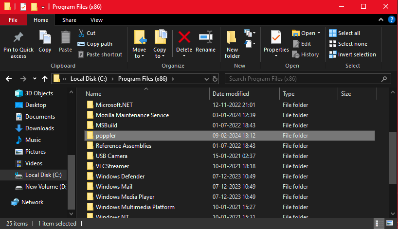

## Automatic ATS llm Tracking System

# steps: 

1. click on this link to download this prerequiste file [Release-23.11.0-0.zip](https://github.com/oschwartz10612/poppler-windows/releases/download/v23.11.0-0/Release-23.11.0-0.zip) (https://github.com/oschwartz10612/poppler-windows/releases/tag/v23.11.0-0)

   
2. unzip the file and there will be 2 file named Library and share, copy these files and them into C:\Program Files (x86)\poppler (make sure you make a new folder named poppler inside programfiles x86)

   

   
3. get your api key for google gemini-pro model from this link (https://makersuite.google.com/app/apikey), paste the key inside .env folder.
4. make a new conda envirnment and install requirments.txt
5. don't forget to play with prompt given inside app.py (more you play more you learn).
6. RUN the app.py by command (streamlit run app.py)
7. copy and job description and upload your resume

